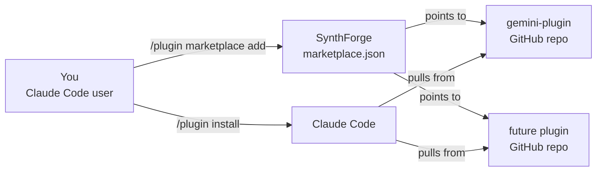

# SynthForge

A friendly home for AI-augmented Claude Code plugins.

[](./LICENSE)
[](https://code.claude.com/docs/en/plugin-marketplaces)
[](#available-plugins)
[](#contributing-a-plugin)

SynthForge is a curated [Claude Code plugin marketplace](https://code.claude.com/docs/en/plugin-marketplaces) focused on AI-augmented developer tooling: subagents, hooks, and skills that pair Claude with other models, services, and workflows. If you want extra capabilities in your Claude Code setup, install from here. If you have built something useful, contribute it.

## How it fits together



SynthForge itself is just a manifest. Each plugin lives in its own GitHub repo and ships its own releases. When you update the marketplace, Claude Code re-reads the manifest and picks up new plugin versions automatically.

## Prerequisites

- [Claude Code](https://code.claude.com/docs/en/overview) installed and signed in.
- A GitHub account with access to public repositories (no token needed for public plugins).
- Git available on your PATH.

## Quickstart

Add the marketplace once:

```bash
/plugin marketplace add azmym/SynthForge
```

Browse what is on offer:

```bash
/plugin marketplace list synthforge
```

Install a plugin you like:

```bash
/plugin install gemini-plugin@synthforge
```

That is it. The plugin's subagents, hooks, and skills are now available in your next Claude Code session.

## Available plugins

| Plugin | Description | Source |
|---|---|---|
| **gemini-plugin** | Gemini-as-second-opinion: validator, challenger, researcher, and summarizer subagents, plus auto-trigger hooks and 8 skills covering text, image, video, music, TTS, and research. | [azmym/gemini-plugin](https://github.com/azmym/gemini-plugin) |

Want yours listed here? See [Contributing a plugin](#contributing-a-plugin).

## Updating plugins

Pull the latest manifest and plugin versions:

```bash
/plugin marketplace update synthforge
```

Run this whenever you want to refresh the catalog or upgrade an installed plugin to its newest tagged release.

## How marketplace updates work

Each entry in [`.claude-plugin/marketplace.json`](./.claude-plugin/marketplace.json) points to a separate GitHub repository. When a plugin author publishes a new release (a tag bump in the plugin's `plugin.json`), users running `/plugin marketplace update synthforge` receive the new version. The marketplace repo itself only changes when plugins are added, removed, or have their metadata updated.

This keeps SynthForge lightweight: plugin authors retain full ownership of their code and release cadence, and we just curate the index.

## Contributing a plugin

We welcome plugins that make Claude Code more useful for real developer work. The process:

1. **Open an issue** describing your plugin: purpose, components (subagents, hooks, skills, slash commands), repo URL, and target audience.
2. **Wait for review.** A maintainer will sanity-check fit, naming, and quality.
3. **Submit a PR** adding an entry to [`.claude-plugin/marketplace.json`](./.claude-plugin/marketplace.json).

### Minimum entry shape

Each plugin entry needs at least `name`, `source`, and `description`. Optional but recommended: `category`, `tags`, and `keywords` for discoverability.

```json
{
  "name": "your-plugin",
  "source": {
    "source": "github",
    "repo": "your-org/your-plugin"
  },
  "description": "One sentence on what it does and who it helps.",
  "category": "ai-assistance",
  "tags": ["short", "scannable", "lowercase"],
  "keywords": ["matches", "what", "users", "search"]
}
```

The full schema lives in the [Claude Code marketplace docs](https://code.claude.com/docs/en/plugin-marketplaces#plugin-entries).

### Quality bar

Before we list a plugin, we look for:

- A clear README in the plugin repo with install and usage instructions.
- A tagged release (so updates resolve to a stable version).
- An OSI-approved license (MIT, Apache-2.0, BSD, etc.).
- No secrets, telemetry without consent, or hostile defaults.

## FAQ

**Do I need a GitHub token?** No, all listed plugins are in public repos.

**How do I uninstall a plugin?** Run `/plugin uninstall <plugin-name>` in Claude Code.

**What if a plugin breaks after an update?** Pin to a known-good tag in your local install, then file an issue on the plugin's repo. Plugin issues belong in the plugin's repo, not here.

**Can I host private plugins through SynthForge?** Not today. SynthForge is a public, curated catalog. Private marketplaces are a separate setup, see the Claude Code docs.

**Who maintains SynthForge?** [@azmym](https://github.com/azmym) and contributors. See the issues tab to chat or propose changes.

## Links

- [Claude Code documentation](https://code.claude.com/docs/en/overview)
- [Plugin marketplace reference](https://code.claude.com/docs/en/plugin-marketplaces)
- [Plugin authoring guide](https://code.claude.com/docs/en/plugins)
- [Marketplace manifest in this repo](./.claude-plugin/marketplace.json)

## License

[MIT](./LICENSE). Plugins listed here carry their own licenses, check each repo before use.
